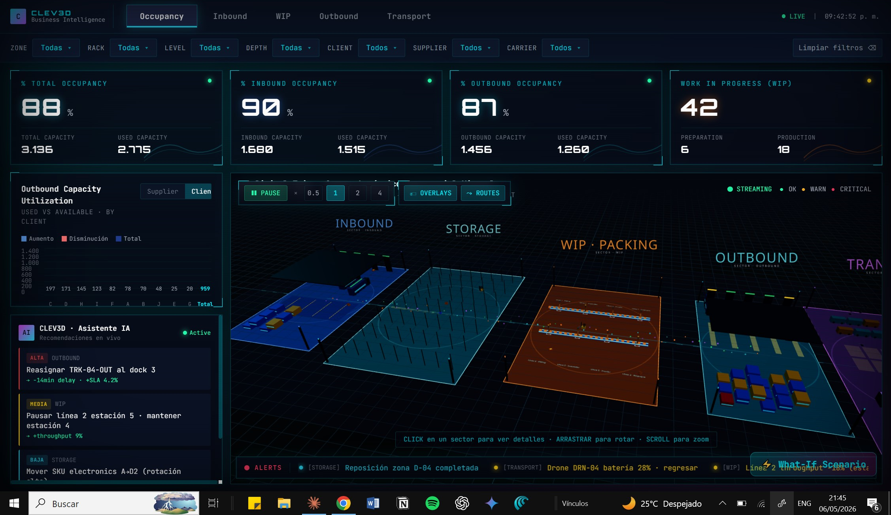
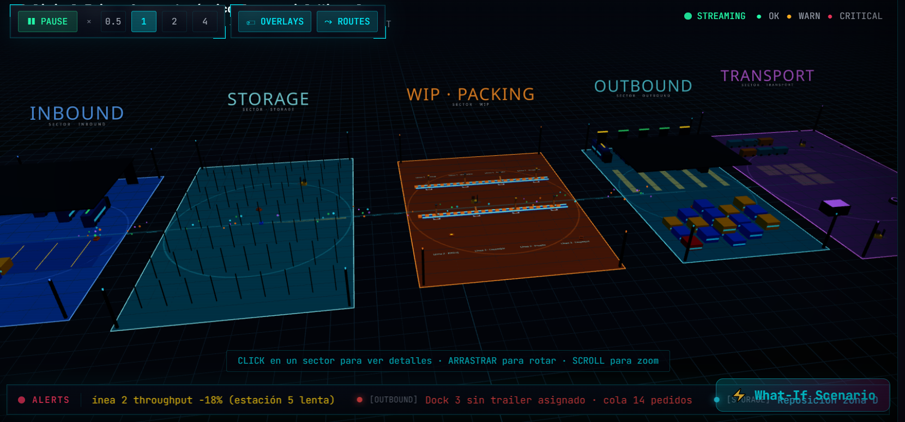
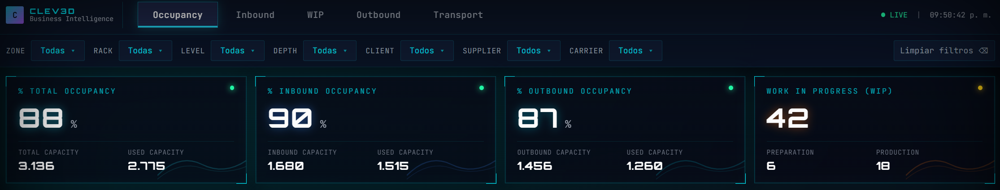
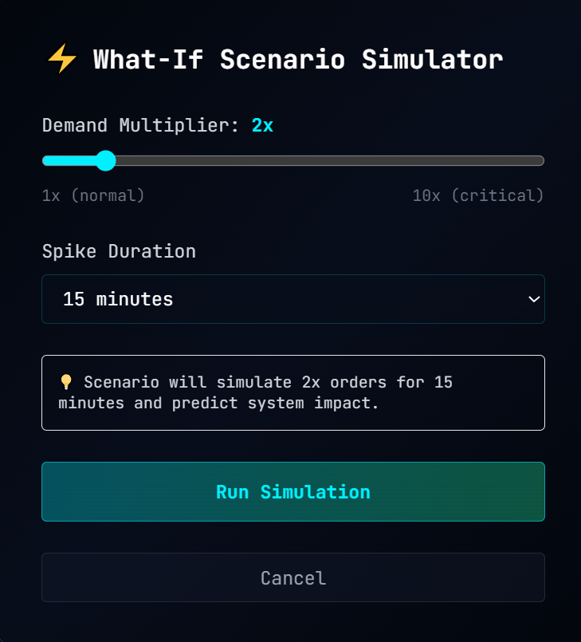
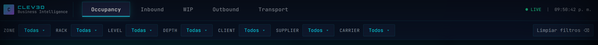

# 📸 Screenshots Guide — CLEV3D

Instructions for capturing and adding images to the README.

---

## 📷 Screenshots to Capture

### 1. **Main Dashboard** (Hero image)
- **What to show:** Full 3D viewer with dashboard
- **View:** Default camera angle showing all 5 sectors
- **Highlights:** 3D scene + KPI strip + waterfall chart visible
- **Suggested name:** `screenshot-main-dashboard.png`
- **Dimensions:** 1920x1080 recommended

**How to capture:**
```bash
# Start the app
npm run dev

# Open http://localhost:5173 in full screen
# Make sure sectors are visible (zoom out with scroll)
# Screenshot entire browser window (without address bar)
# Dimensions: 1920x1080 or similar
```

---

### 2. **3D Viewer Close-up**
- **What to show:** Just the 3D scene with all sectors visible
- **View:** Zoomed in to show detail
- **Highlights:** Racks, trailers, drones, conveyor belts
- **Suggested name:** `screenshot-3d-viewer.png`

**How to capture:**
```bash
# Zoom in to see sector details
# Show at least 3-4 sectors clearly
# Include Order Flow particles (cyan line with spheres)
```

---

### 3. **Dashboard Left Side**
- **What to show:** Waterfall chart + AI Panel
- **Highlights:** Chart bars, recommendations cards
- **Suggested name:** `screenshot-dashboard-left.png`

**How to capture:**
```bash
# Focus on left sidebar
# Show Waterfall with colored bars
# Show AI Panel with 3 recommendations (ALTA/MEDIA/BAJA)
```

---

### 4. **Inspector Panel**
- **What to show:** Right sidebar when clicking a sector
- **Highlights:** Sparkline, entity list, stats
- **Suggested name:** `screenshot-inspector-panel.png`

**How to capture:**
```bash
# Click on a sector (e.g., STORAGE)
# Inspector slides in from right
# Screenshot showing sparkline + entities list
```

---

### 5. **What-If Modal**
- **What to show:** Demand simulator dialog
- **Highlights:** Sliders, metrics cards, export button
- **Suggested name:** `screenshot-whatif-modal.png`

**How to capture:**
```bash
# Click ⚡ What-If Scenario button (bottom-right)
# Modal appears with controls
# Screenshot the entire modal
```

---

### 6. **Alert Ticker**
- **What to show:** Bottom scrolling alerts
- **Highlights:** Colored alerts flowing
- **Suggested name:** `screenshot-alert-ticker.png`

**How to capture:**
```bash
# Look at bottom of 3D viewer
# Alerts scroll continuously with icons
# Take a screenshot of the ticker area
```

---

### 7. **Top Controls**
- **What to show:** Play/pause, speed, overlays buttons
- **Highlights:** Buttons in top-left corner
- **Suggested name:** `screenshot-toolbar.png`

**How to capture:**
```bash
# Look at top-left of 3D viewer
# Show play/pause button and speed controls
# Show toggle buttons for overlays and routes
```

---

## 🎨 Image Placement in README

```markdown
# CLEV3D · Centro Logístico Empresarial Virtual 3D

[Hero image here: Main dashboard]

## 🎯 Características Principales

### Dashboard BI Dark (Power BI Style)

[Image: Dashboard left side - Waterfall + AI Panel]

### Escena 3D (React Three Fiber + drei)

[Image: 3D viewer showing all sectors]

### Inspector Lateral Interactivo

[Image: Inspector panel with sparklines]

## Controls & Features

[Image: Top toolbar controls]

[Image: What-If modal]

[Image: Alert ticker]
```

---

## 📸 How to Add Screenshots

### Step 1: Take Screenshots
Use the instructions above to capture PNG images.

### Step 2: Optimize Images
```bash
# Optional: Compress images
# Using ImageOptim (macOS) or similar tool
# Or online: https://tinypng.com/
```

### Step 3: Create `docs/screenshots/` Folder
```bash
mkdir -p docs/screenshots
# Place all PNG files here
```

### Step 4: Update README.md
```markdown

```

### Step 5: Commit & Push
```bash
git add docs/screenshots/
git add README.md
git commit -m "docs: Add screenshots to README"
git push origin main
```

---

## 🎬 Alternative: GIF Animations

For more impact, consider creating short GIFs:

### GIF 1: 3D Camera Movement
- Show camera rotating around sectors
- Duration: 3-5 seconds
- Tool: ScreenFlow (macOS) or ShareX (Windows)

### GIF 2: Inspector Panel Opening
- Click sector → panel slides in with data
- Duration: 2 seconds

### GIF 3: What-If Simulation
- Adjust slider → impact metrics update
- Duration: 3 seconds

---

## 📝 README Section Template

```markdown
## 🎯 Visual Overview

### Main Dashboard

*3D Digital Twin with BI-style dashboard showing 5 logistics sectors*

### 3D Viewer Detail

*Real-time 3D visualization with animated fleet (trailers, drones, robots)*

### Inspector Panel

*Click any sector to open inspector with sparklines and entity list*

### What-If Scenarios

*Simulate demand spikes and predict system impact (1-10x multiplier)*

### Top Controls

*Play/pause, speed control, overlays toggle, route visualization*
```

---

## 🎨 Image Dimensions

**Optimal sizes:**
- Hero image: 1920x1080 or 1280x720
- Standard sections: 1024x576 or 800x450
- Mobile: 100% responsive (auto-scales)

**File format:** PNG (transparent backgrounds, no lossy compression)
**File size:** <500KB per image (optimize if needed)

---

## 💡 Tips for Better Screenshots

1. **Lighting:** Use bright display, good contrast
2. **Content:** Make sure data is visible and interesting
3. **Consistency:** Use same resolution for all images
4. **Clarity:** No blurry text, readable UI elements
5. **Branding:** Show the BI dark theme colors clearly

---

## 🔗 Ready to Add Images?

1. Take screenshots using instructions above
2. Save to `docs/screenshots/` folder
3. Update README.md with image references
4. Commit & push to GitHub

**Alternative:** Use the `docs/images/` folder structure instead.

---

**Once images are added, your README will be 10x more attractive! 🚀**
